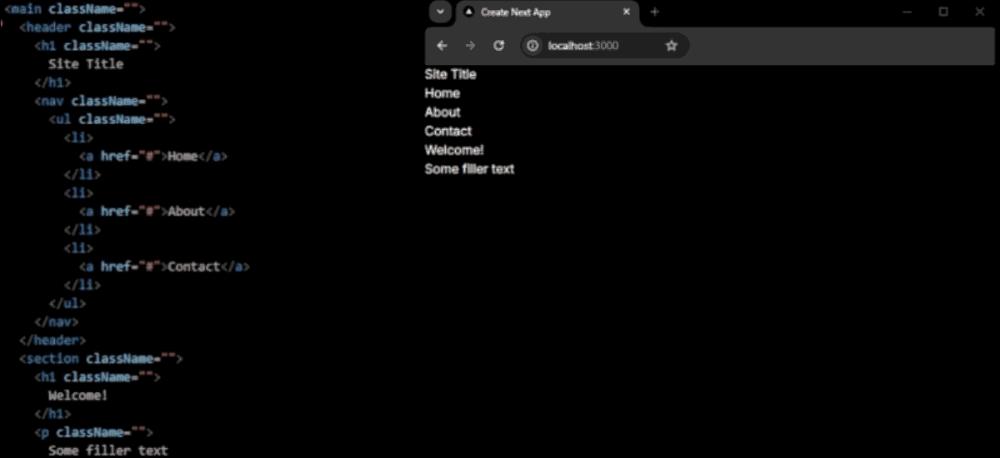

# 🎨 css-utilities-generator [](https://www.npmjs.com/package/css-utilities-generator)



TypeScript utility package that generates a utilities.css file on demand with shorthand class names for common CSS properties. By using intuitive notations like d-f (display: flex) as values for className attributes inside your jsx, this package streamlines your styling process, making your main CSS structure cleaner, reusable and more maintainable while ensuring consistent, efficient application of styles across your project.

## Installation & Setup (Auto)
First, install the css-utilities-generator package, dependencies and configuration files into your project:
```bash
# Automatic installation executable:
> npx create-css-utilities
```

Run the following command to start generatic css utilities:
```bash
# Run the following command (generates css utilities on save):
> npm run utils
```
Now import the generated css file to the project root file, start watching for changes in your root directory and automatically regenerate the CSS utilities. 

## Example
```html
  <main className="ml-50 mr-50">
    <header className="d-f h-64px ai-c jc-sb pos-sticky top-0 z-5">
      <h1 className="w-fc">
        Site Title
      </h1>
      <nav className="w-300px">
        <ul className="d-f jc-sb">
          <li>
            <a href="#">Home</a>
          </li>
          <li>
            <a href="#">About</a>
          </li>
          <li>
            <a href="#">Contact</a>
          </li>
        </ul>
      </nav>
    </header>
    <section className="d-f fd-co ai-c jc-c h-80">
      <h1 className="fs-40 fw-700">
        Welcome!
      </h1>
      <p className="mt-2rem fs-12 o-70 fw-2">
        Some filler text
      </p>
    </section>
  </main>
```
> some-file.tsx
```css
.ml-50 { margin-left: 50px; }
.mr-50 { margin-right: 50px; }
.d-f { display: flex; }
.h-64px { height: 64px; }
.ai-c { align-items: center; }
.jc-sb { justify-content: space-between; }
.pos-sticky { position: sticky; }
.z-5 { z-index: 5; }
.w-fc { width: fit-content; }
.w-300px { width: 300px; }
.fd-co { flex-direction: column; }
.jc-c { justify-content: center; }
.h-80 { height: 80%; }
.fs-40 { font-size: 40px; }
.fw-700 { font-weight: 700; }
.mt-2rem { margin-top: 2rem; }
.fs-12 { font-size: 12px; }
.o-70 { opacity: 70%; }
.fw-2 { font-weight: 2; }
```
> utilities.css

## Configuration File (Defaults)
```javascript
{
    "onlyDictionary": true, /* Matching only dictionary or extension properties, Defaults to false */
    "acceptAnyKey": false,
    "acceptAnyValue": true,
    "units": "rem", /* Defines unit for those css properties with numeric values or others, Defaults to "px" */
    "extendKeys": /* Extend default dictionary abbreviations */ 
    {
        "fs": {"name": "font-size", "valueExtension": "vw"}, /* Would match for fs className */
        "fi": {"name": "filter", "valueExtension": ""} /* Would match for fs className */
    },
    "writeTo": "./styles/utilities.css", /* Where to write generated css file, Defaults to "./styles/utilities.css" */
    "readFrom": "./", /* Where to parse - interpret files from, Defaults to "./" */
    "extensions": ["tsx", "ts", "js", "jsx"] /* Read className attributes from files with extensions in Array */
    "exclude": ["node_modules", ".git"] /* Exclude directories from having files parsed, traversed ...  */
}
```
> /cuconfig.json

## Usage
Example of jsx elements with above configuration set, variables usage and their respective generated classes at utilities.css

```html
<div className="d-f ml-40">
    <h1 className="fs-2 c--brand-primary">
        Hello World!
...
```
> /src/some-file.tsx
```css
...
.d-f {display: flex}
.ml-40 {margin-left: 40rem}
.fs-2 {font-size: 2vw}
.c--brand-primary {color: var(--brand-primary)}
...
```
> src/styles/utilities.css

# Contributions

This project encourages contributions and suggestions.
